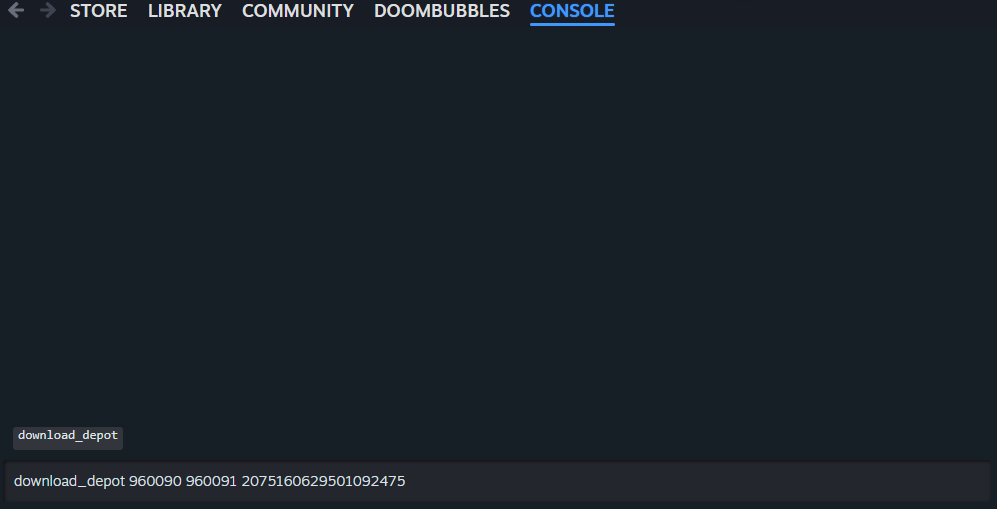
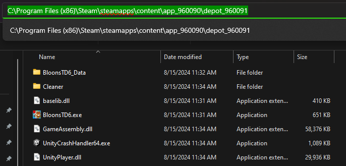
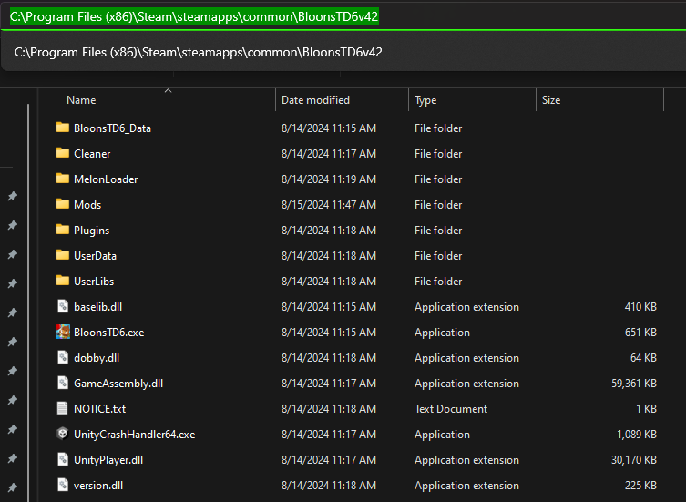
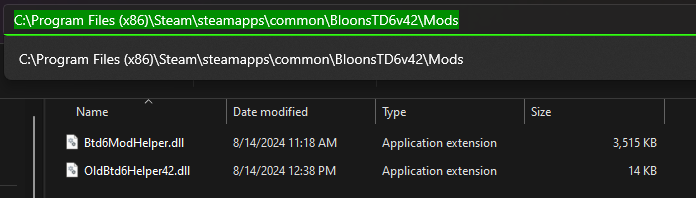

<h1 align="center">
<a href="https://github.com/doombubbles/old-btd6-helper/releases/latest">
    
    
</a>
Old BTD6 Helper
</h1>

### A mod that helps you play older versions of BTD6 in offline mode on separate profiles.

### What this mod **DOES NOT** do:
- Make any changes to your normal BTD6 Profile
- Allow for *anything* unlocked on these separate profiles to be transferred to your normal BTD6 profile
- Allow you to use actual Online Features like CO-OP / Map Browser / Trophy Store

### What this mod **DOES** do:
- Enforces Offline Mode
- Switches the local profile path to a separate, game version specific path
- Skips the tutorial and gives new profiles a head start on tower/upgrade/map/knowledge unlock progression for testing purposes
- Allows access to the local Challenge/Map/Odyssey Editors and Boss Challenges

## How to Download Old Versions

As long as you own a copy of BTD6 on Steam, you can utilize the Steam Console to download old builds or "depots" of
games.

### Steam Console

Use this deep link to open the Steam Console (Control + Click for a new Tab)

<a href="https://doombubbles.github.io/steam" title="GitHub doesn't directly allow non-HTTP(s) links, so this a redirect to steam://open/console from a GitHub Pages site">Open Steam Console</a>

Or Copy this URL to a new Browser Tab

```
steam://open/console
```

(Takes a few seconds before it actually opens)



### Depot Download Commands

From the Steam console you can then run a command to download the associated game version.
The following are the specific depots used to test this mod on.

<table>
<tr>
    <th>BTD6 Version</th> <th>Download Depot Command</th> <th>Mod Helper</th> <th>OldBtd6Helper</th>
</tr>

<tr>
<td align="center">v43.3</td>
<td>

```
download_depot 960090 960091 6288166319192838291
```

</td>
<td align="center"><a href="https://github.com/gurrenm3/BTD-Mod-Helper/releases/download/3.1.21/Btd6ModHelper.dll">3.1.21</a></td>
<td align="center"><a href="https://github.com/doombubbles/old-btd6-helper/releases/latest/downloads/OldBtd6Helper43.dll">Latest v43</a></td>
</tr>
<tr></tr>


<tr>
<td align="center">v42.3</td>
<td>

```
download_depot 960090 960091 6396713242457093672
```

</td>
<td align="center"><a href="https://github.com/gurrenm3/BTD-Mod-Helper/releases/download/3.1.20/Btd6ModHelper.dll">3.1.20</a></td>
<td align="center"><a href="https://github.com/doombubbles/old-btd6-helper/releases/latest/downloads/OldBtd6Helper42.dll">Latest v42</a></td>
</tr>
<tr></tr>


<tr>
<td align="center">v41.2</td>
<td>

```
download_depot 960090 960091 2075160629501092475
```

</td>
<td align="center"><a href="https://github.com/gurrenm3/BTD-Mod-Helper/releases/download/3.1.17/Btd6ModHelper.dll">3.1.17</a></td>
<td align="center"><a href="https://github.com/doombubbles/old-btd6-helper/releases/latest/downloads/OldBtd6Helper41.dll">Latest v41</a></td>
</tr>
<tr></tr>


<tr>
<td align="center">v40.2</td>
<td>

```
download_depot 960090 960091 7051754864164438105
```

</td>
<td align="center"><a href="https://github.com/gurrenm3/BTD-Mod-Helper/releases/download/3.1.16/Btd6ModHelper.dll">3.1.16</a></td>
<td align="center"><a href="https://github.com/doombubbles/old-btd6-helper/releases/latest/downloads/OldBtd6Helper40.dll">Latest v40</a></td>
</tr>
<tr></tr>


<tr>
<td align="center">v39.2</td>
<td>

```
download_depot 960090 960091 7764235853680216941
```

</td>
<td align="center"><a href="https://github.com/gurrenm3/BTD-Mod-Helper/releases/download/3.1.15/Btd6ModHelper.dll">3.1.15</a></td>
<td align="center"><a href="https://github.com/doombubbles/old-btd6-helper/releases/latest/downloads/OldBtd6Helper39.dll">Latest v39</a></td>
</tr>
<tr></tr>

</table>

[See SteamDB for a full list of manifests](https://steamdb.info/depot/960091/manifests/)

Further back versions may become officially supported at a later time.

### Move Downloaded Depot

Even with fast internet these depot downloads usually take a minute or two to resolve.

Once finished the console will tell you the location the old game version was downloaded to, 
such as 
```
Depot download complete : "C:\Program Files (x86)\Steam\steamapps\content\app_960090\depot_960091"
```



From there it's recommended that you make a new folder next to the normal BloonsTD6 folder and move the contents of the depot there.
For making this mod I used a path such as `C:\Program Files (x86)\Steam\steamapps\common\BloonsTD6v42`

### Install MelonLoader and Mod Helper

Now that you have the old build, simply follow the standard [Mod Helper Install Guide](https://gurrenm3.github.io/BTD-Mod-Helper/wiki/Install-Guide), 
except you'll need to install an old build of Mod Helper appropriate for the version you've downloaded.
The table above contains the links to the recommended downloads of Mod Helper for each of the game versions.

**Remember to specifically install MelonLoader 0.6.1.**



### Install this Mod

Finally, download the appropriate OldBtd6Helper.dll and put it in the Mods folder. The corresponding versions are also listed in the table above.



### And That's It!

[](https://github.com/gurrenm3/BTD-Mod-Helper#readme)
